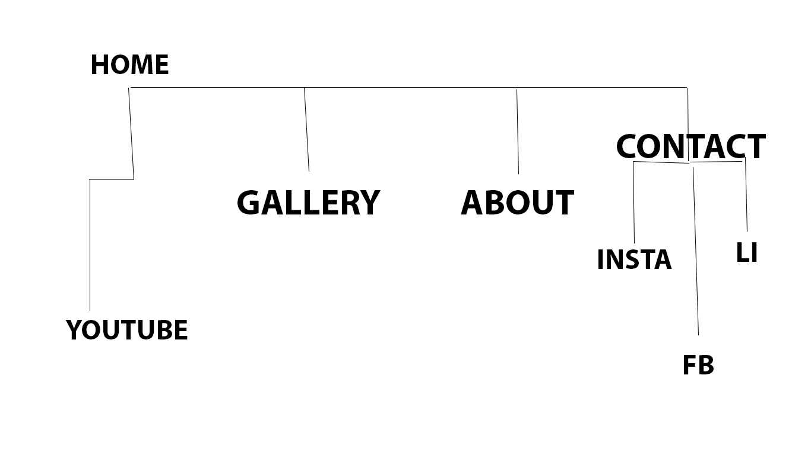
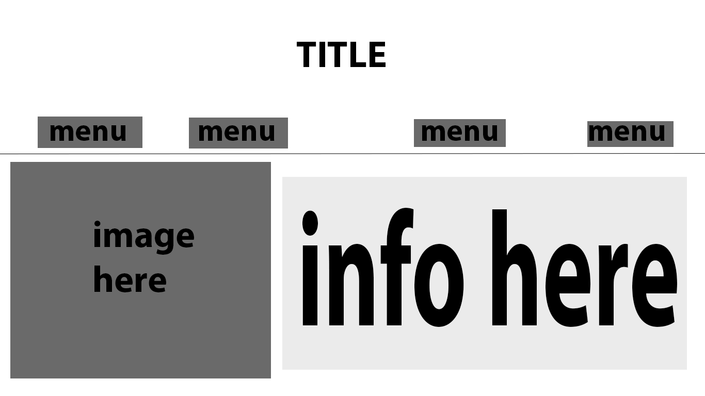
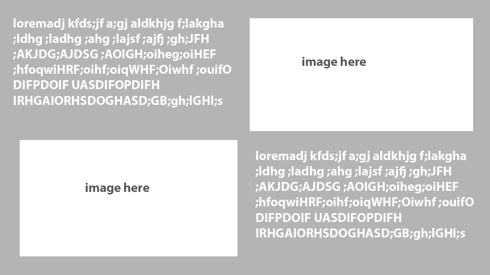
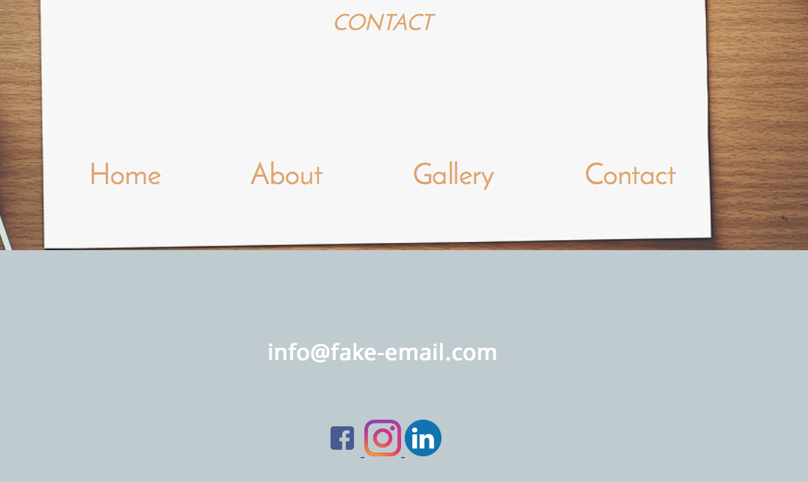

I plan on making a simple portfolio page for myself showcasing a little of my work. I don't expect it to be super fancy. I don't plan on actually using it in future, I think when the the time comes I will use the general layout of the project. I won't write actual things in any large text involved. The concept of this site is more of a potential layout for future content.

The most difficult part of this assignmen was the manipulation of the Hero image and have it scale appropriately. I also had issues with padding/margins and what to apply them to. But overall i'm pretty ok with the website.

One thing I am confused about is with there are _ between each of my buttons/links. 
